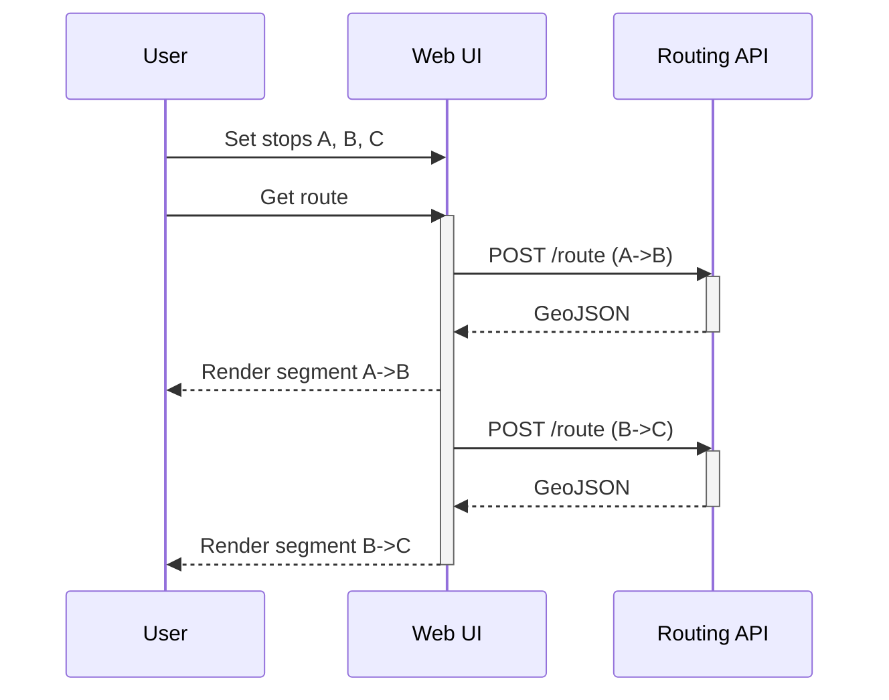
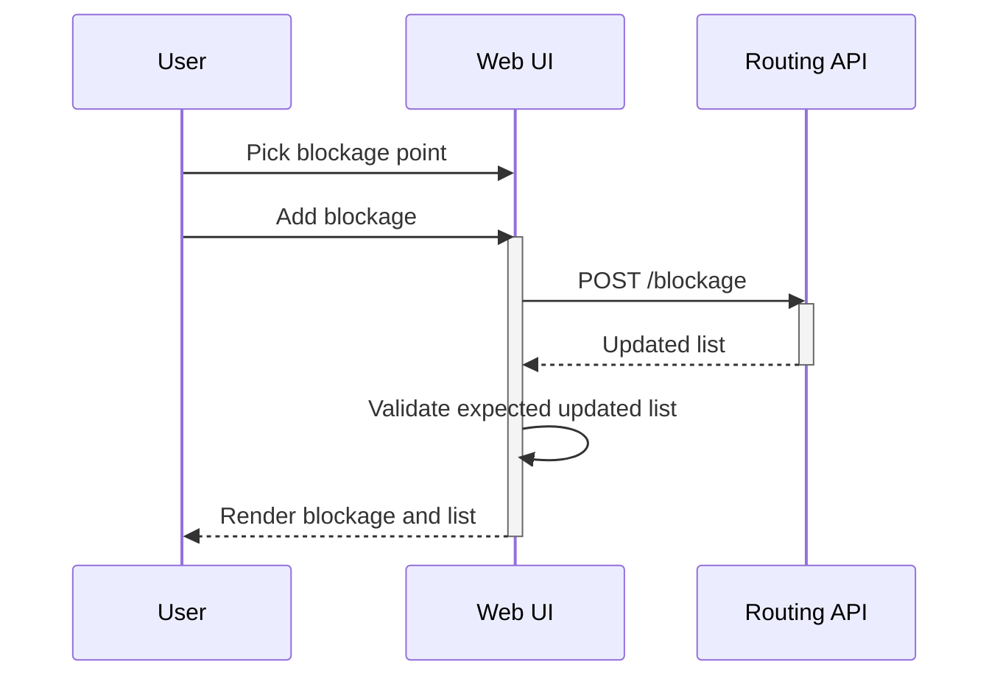
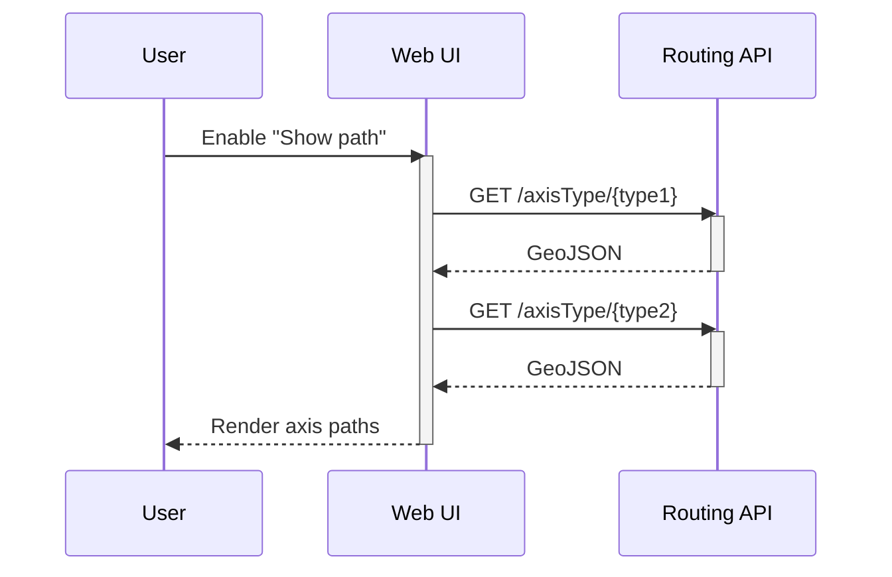

# Software Design Description

## App Specs

- Frontend: React + TypeScript (Vite)
- Mapping: Leaflet via react-leaflet, GeoJSON for map data
- Styling: plain CSS
- API: `https://routing-web-service-ityenzhnyq-an.a.run.app`

## Decision Reasonings

### Stop routing on first invalid segment
If any segment fails validation, routing stops for subsequent segments. Users want a complete route, so the UI avoids showing partial paths that could be misleading. They can adjust inputs or refresh and try again.

### Axis-type path overlay on demand
Axis-type paths are fetched only when the user enables "Show path." This reduces unnecessary server load and avoids cluttering the map during normal routing. The data is not stored locally because the feature is rarely used, and rendering the full network introduces noticeable lag, so keeping it on-demand minimizes performance impact.

### Blockage updates with optimistic stability
When adding a blockage, the app validates that the new blockage is present in the response before updating the map. If the response is invalid or missing the new entry, an error toast is shown. This avoids extra fetches, prevents blank UI states, and keeps the list stable while still confirming the update.

### Toast-based feedback for actions
Errors, warnings, and success messages are shown as temporary toasts instead of inline panels. This keeps the side panel focused on primary controls while still surfacing feedback in a consistent, non-blocking way.

### Map style persistence
The detailed/simplified map choice is stored locally so users keep their preferred view across refreshes. This avoids forcing repeated toggles and improves perceived responsiveness.

## Sequence Diagrams

### Get route for multiple stops

### Add blockage

### Toggle axis path overlay

